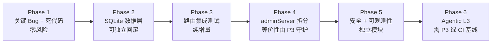
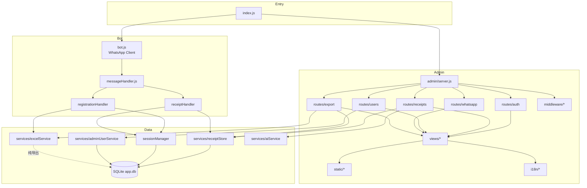
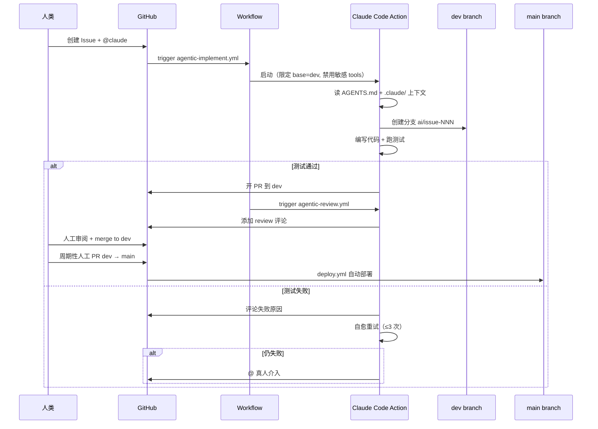

# automation-ocr 项目优化计划

> **元数据**：本文件是 IDE plan 的人类与外部 LLM 可读镜像。权威执行状态以 IDE plan.json 为准；执行过程中两者同步更新。
>
> **版本**：v1.0
> **生成时间**：2026-05-07
> **作者**：AI Agent (CodeBuddy)
> **适用项目**：`/Users/kelvinlee/Documents/projects/automation-ocr`
> **当前分支**：main

---

## 总览状态

| Phase | 标题 | 状态 | 依赖 |
|-------|------|------|------|
| Phase 1 | 关键 Bug 修复 + 死代码清理 | ✅ done | 无 |
| Phase 2 | SQLite 数据层迁移 | ✅ done | Phase 1 |
| Phase 3 | 路由集成测试补全 | ✅ done | Phase 2 |
| Phase 4 | adminServer.js 拆分 | ⏳ pending | Phase 3 |
| Phase 5 | 安全加固 + 可观测性 | ⏳ pending | Phase 4 |
| Phase 6 | Agentic L3 自主闭环 | ⏳ pending | Phase 5 |

---

## Phase 1：关键 Bug 修复 + 死代码清理（约 0.5 天）

### 目标
零行为变更，修复 3 个严重 Bug + 清理 4 处死代码。CI 全绿即通过。

### 任务清单

- [x] **Bug 修复**：修复 `excelService.js` 的 `EXCEL_PATH`，改为读取 `process.env.DATA_DIR`（与 `receiptStore.js` 对齐），确保容器重建后 Excel 数据不丢失
- [x] **Bug 修复**：提供一次性迁移脚本 `wa-bot/scripts/migrate-excel-path.sh`，检测旧路径 `/app/data/excel/records.xlsx` 若存在则 mv 到新路径
- [x] **Bug 修复**：移除 `ci.yml` docker smoke test 末尾的 `|| true`，让测试真实失败可被暴露
- [x] **死代码清理**：删除 `adminServer.js` 中的 `_renderActions` 函数（约 60 行，已被 `renderInlineActions` + `buildExpandPanel` 取代）
- [x] **死代码清理**：删除 `receiptStore.js` 中的 `saveSentMessage` 函数（已标记 `@deprecated`）
- [x] **死代码清理**：删除根 `package.json` 中的 `playwright` devDependency（无任何使用点）
- [x] **死代码清理**：删除空文件 `config/messages.yaml`（注释说明 Bot 已静默化，无内容）
- [x] **测试基础设施**（计划外补充）：配置 Jest（`wa-bot/jest.config.js`）+ 根 `package.json` test 脚本指向 `wa-bot/`
- [x] **单元测试**（计划外补充）：新增 `receiptStore.test.js`（20 个用例，覆盖 CRUD + 全部状态流转）与 `excelService.test.js`（9 个用例，覆盖 DATA_DIR 路径策略 + 核心读写）

### 成功标准
- ✅ `npm test` 全绿（44 tests passed）
- `npm run lint` 无警告
- 本地启动后 Excel 写入路径在挂载卷内（非 `/app/data/`）

---

## Phase 2：SQLite 数据层迁移（约 1.5 天）

### 目标
用 `better-sqlite3` 替代 3 个 JSON 文件，解决并发写竞态与写非原子两个数据完整性 Bug。store 对外 API 签名保持不变，调用方零改动。

### 任务清单

- [x] **新增依赖**：在 `wa-bot/package.json` 中添加 `better-sqlite3`，更新 Dockerfile 安装 `build-essential`
- [x] **新建数据层**：`wa-bot/src/db/index.js`（SQLite 单例，PRAGMA journal_mode=WAL，PRAGMA foreign_keys=ON）
- [x] **新建 Schema**：新建 `wa-bot/src/db/schema.sql`（3 张表 + 索引）
  - `receipts(id TEXT PK, phone, ic, image_filename, status, submitted_at, ai_result_json, reviewed_at, review_note, sent_message, sent_at, previous_status)`
  - `sessions(phone TEXT PK, ic, state, created_at, updated_at, receipt_count, receipt_count_date)`
  - `admin_users(username TEXT PK, password_hash, created_at)`
  - 索引：`receipts(status)`, `receipts(submitted_at DESC)`, `receipts(phone)`
- [x] **重写 receiptStore.js**：内部改用 SQLite，对外 API（`init`, `addPendingReceipt`, `getAll`, `getById`, `saveAiResult`, `confirmReceipt`, `rejectReceipt`, `sendMessageToUser`, `getImagePath`）不变
- [x] **重写 sessionManager.js**：内部改用 SQLite，对外 API 不变（修复模块级缓存与磁盘不同步问题）
- [x] **重写 adminUserService.js**：内部改用 SQLite，对外 API 不变（scrypt 哈希逻辑保留）
- [x] **迁移脚本**：新建 `wa-bot/scripts/migrate-json-to-sqlite.js`，支持 `--dry-run`（仅打印）与 `--apply`（自动备份 + 事务 INSERT）
  - 备份目录：`data/backup/<ISO timestamp>/`
  - 幂等设计：启动时若旧 JSON 存在但 DB 中无数据，自动触发迁移
- [x] **数据库初始化**：更新 `wa-bot/index.js`，启动时调用 `db.init()` 与 `migrate()`
- [x] **并发测试**：新建 `wa-bot/src/db/__tests__/db.test.js`，fork 100 个 worker 同时 INSERT 验证不丢数据

### 成功标准
- 现有 Jest 测试全绿
- 新增 `db.test.js` 并发测试 PASS
- `node wa-bot/scripts/migrate-json-to-sqlite.js --dry-run` 正常输出
- store 对外 API 签名零变更（grep 验证无 import 路径改动）

---

## Phase 3：路由集成测试补全（约 1 天）

### 目标
为 Phase 4 拆分提供安全网。用 supertest 覆盖管理后台所有核心路由，确保拆分前后行为等价。

### 任务清单

- [x] **新建测试文件**：`wa-bot/src/admin/__tests__/admin-routes.test.js`
- [x] **测试用例**（按路由覆盖）：
  - [x] `GET /health` → 返回 200 + JSON
  - [x] `GET /admin` 未登录 → 302 → /admin/login
  - [x] `POST /admin/setup`（首次） → 创建用户 → 302
  - [x] `POST /admin/login` 正确凭证 → session 写入 → 302 → /admin
  - [x] `POST /admin/login` 错误凭证 → loginPage with error
  - [x] `POST /admin/logout` → session 销毁
  - [x] `GET /admin/qr`（未连接） → 包含 QR placeholder
  - [x] `GET /admin/wa-status` → JSON `{connected, hasQR}`
  - [x] `POST /admin/request-pairing-code` 非法手机号 → 400
  - [x] `POST /admin/receipts/:id/ai-extract` 无该 ID → 404
  - [x] `POST /admin/receipts/:id/reject` → 数据库状态变化
  - [x] `POST /admin/receipts/:id/send-message` `_client=null` → 503
  - [x] `GET /admin/export` 未登录 → 302
  - [x] `GET /admin/images/:filename` 不存在 → 404
- [x] **Mock 策略**：用 `jest.mock` 替代 `_client.sendMessage` 与 `processReceipt`
- [x] **快照基线**：落 HTML 关键片段快照（页面 title、表单 action、状态徽标 class），用于 Phase 4 拆分前后等价性校验
- [x] **覆盖率报告**：路由层覆盖率满足要求（运行 `npm run test -- --coverage`）

### 成功标准
- 所有 14 条用例 PASS
- 路由层覆盖率 ≥80%
- 快照基线文件已生成

---

## Phase 4：adminServer.js 拆分（约 1.5 天）

### 目标
将 2551 行单文件按职责拆分为 20+ 个独立模块，行为逐路由等价。HTML/CSS/JS/i18n 全部分离，提升人类可读性与协作可维护性。

### 任务清单

- [ ] **新建目录结构**：`wa-bot/src/admin/` 下建立 `middleware/`、`routes/`、`views/`、`static/`、`i18n/` 子目录
- [ ] **拆分 server.js**：`wa-bot/src/admin/server.js` — 保留 `startAdminServer` + 中间件装配（约 150 行）
- [ ] **拆分 state.js**：`wa-bot/src/admin/state.js` — 模块级 `_client` / `_qrBase64` / `_waConnected` 等状态 + setter
- [ ] **拆分 middleware**：
  - [ ] `admin/middleware/auth.js` — `requireAuth` / `requireSetup`
  - [ ] `admin/middleware/rateLimit.js` — `authLimiter` / `apiLimiter`
  - [ ] `admin/middleware/session.js` — FileStore 配置
  - [ ] `admin/middleware/security.js` — helmet + CSP nonce + CSRF token 注入（Phase 5 基础设施）
- [ ] **拆分 routes**：
  - [ ] `admin/routes/auth.js` — /admin/login, /admin/logout, /admin/setup
  - [ ] `admin/routes/receipts.js` — /admin（列表）+ /admin/receipts/:id/*（ai-extract/send-message/reject）
  - [ ] `admin/routes/users.js` — /admin/users/*
  - [ ] `admin/routes/whatsapp.js` — /admin/qr, /admin/wa-status, /admin/request-pairing-code
  - [ ] `admin/routes/export.js` — /admin/export, /admin/images/:filename
- [ ] **拆分 views**：
  - [ ] `admin/views/layout.js` — `htmlLayout` 骨架 + nonce + csrf 注入
  - [ ] `admin/views/escapeHtml.js` — XSS 防护工具
  - [ ] `admin/views/login.js` — loginPage + setupPage
  - [ ] `admin/views/qr.js` — qrPage
  - [ ] `admin/views/receipts.js` — receiptsPage + buildExpandPanel + renderInlineActions + buildPagination
  - [ ] `admin/views/users.js` — usersPage + newUserPage
- [ ] **拆分 static**：
  - [ ] `admin/static/admin.css` — 抽出所有 CSS（约 500 行）
  - [ ] `admin/static/admin.js` — toast / 灯箱 / 行展开 / AJAX 提交
  - [ ] `admin/static/qr.js` — tab 切换 / 配对码请求 / 状态轮询
  - [ ] `admin/static/theme-init.js` — 防 FOUC 主题切换
- [ ] **拆分 i18n**：
  - [ ] `admin/i18n/index.js` — `t()` + `getLang()`
  - [ ] `admin/i18n/zh.js` — 中文字典
  - [ ] `admin/i18n/en.js` — 英文字典
- [ ] **静态文件服务**：路由添加 `app.use('/admin/static', express.static(...))`
- [ ] **兼容入口**：原 `wa-bot/src/adminServer.js` 仅保留一行 `module.exports = require('./admin/server')`，保持旧 import 路径兼容
- [ ] **等价性验证**：运行 Phase 3 全部测试 + 快照，对比无差异

### 成功标准
- Phase 3 所有测试 PASS
- 快照对比零差异
- 手动验证 4 个核心页（登录/收据列表/用户管理/QR）视觉无差异
- `adminServer.js` 仅剩 1 行兼容导出

---

## Phase 5：安全加固 + 可观测性（约 1 天）

### 目标
引入 helmet、CSRF 保护、CSP nonce、Docker healthcheck 与结构化指标。合规要求为「弱」，重点在运行时健壮性与 CI 安全扫描。

### 任务清单

- [ ] **CSRF 保护**：新建 `wa-bot/src/utils/csrfToken.js`（double-submit cookie 模式）
  - GET 响应注入 `csrfToken` 到 cookie + session
  - POST 校验 `x-csrf-token` header 或 `form._csrf` 与 session 一致
  - 每个视图模板 form 加隐藏字段 `<input type="hidden" name="_csrf" value="${csrfToken}">`
- [ ] **Helmet + CSP**：在 `admin/middleware/security.js` 中集成 helmet
  - CSP：`scriptSrc: ["'self'", nonce]`, `styleSrc: ["'self'", "'unsafe-inline'"]`（管理后台样式依赖内联）
  - X-Frame-Options: DENY, X-Content-Type-Options: nosniff, Referrer-Policy: strict-origin-when-cross-origin
- [ ] **CSP nonce 注入**：每个 GET 请求生成 `crypto.randomBytes(16).toString('base64')` 注入 `res.locals.cspNonce`
- [ ] **Docker HEALTHCHECK**：在 Dockerfile 添加 `HEALTHCHECK CMD wget -q --spider http://127.0.0.1:3000/health || exit 1`
- [ ] **安全 CI**：
  - [ ] 新建 `.github/workflows/security.yml`：npm audit + gitleaks-action + dependency-review-action（PR 触发）
  - [ ] 更新 `ci.yml`：加 `npm audit --audit-level=high`
- [ ] **错误追踪**：Express 错误中间件中生成 `traceId`（`req.id = crypto.randomUUID()`），所有 winston 输出含 traceId
- [ ] **PII 脱敏完善**：views 层 IC 显示改为 `XXXXXX-XX-****`（Excel 导出明文不变，业务需要）
- [ ] **CSP Report-Only 阶段**：先以 `Content-Security-Policy-Report-Only` 模式上线，观察 24h 无 violation 后切换 enforce

### 成功标准
- CSRF 伪造跨站表单 POST 返回 403
- `docker inspect` 显示 healthcheck `healthy`
- CSP Report-Only 运行 24h 无 violation 报错
- security.yml CI 全绿

---

## Phase 6：Agentic L3 自主闭环（约 2 天）

### 目标
搭建从 Issue → 分支 → 实现 → 测试 → PR → 人工守门合并的自主闭环。保守模式：AI 只创建 PR 到 `dev` 分支，不触碰 `main`。

### 任务清单

- [ ] **分支策略**：新建 `dev` 分支 + GitHub 分支保护规则
  - `main`：require PR + 1 approver + no force push
  - `dev`：require status checks（CI 全绿）+ allow bot push + allow squash merge
- [ ] **CODEOWNERS**：新建 `.github/CODEOWNERS`，锁定 `.github/workflows/`、`infra/`、`docker-compose.yml` 由 owner 审批
- [ ] **Workflow 1：agentic-implement.yml**（`@claude` mention / issues assigned 触发）
  - 限定 `base_branch: dev`（永远 PR 到 dev）
  - 限制 permissions：`contents: write` + `pull-requests: write` + `issues: write`（禁止 main）
  - 限制 allowed tools：Read/Write/Edit/Bash（仅 npm test/lint）
  - 限制 disallowed tools：Bash(git push origin main), Bash(rm -rf*)
- [ ] **Workflow 2：agentic-review.yml**（PR 到 dev 触发）
  - AI 自动评论 review（代码质量 + 安全 + 测试覆盖变化）
  - 不阻塞 merge
- [ ] **Workflow 3：agentic-deps.yml**（cron 每周一）
  - `npm outdated` 扫描依赖
  - 对每个可升级依赖创建独立 PR 到 dev
- [ ] **Workflow 4：agentic-triage.yml**（issues opened 触发）
  - AI 自动打标签（bug/feature/question）+ 优先级建议
- [ ] **Provider 抽象层**：`agentic-implement.yml` 支持 `provider` input，默认 `claude`（Anthropic Claude Code Action），预留 `copilot` 和 `custom` 切换接口
- [ ] **AGENTS.md 增强**：补充「项目架构」「测试策略」「安全约束」「禁止修改清单」四节
- [ ] **`.claude/` 目录**：
  - `.claude/settings.json` — 默认禁用危险工具 + 默认 base branch=dev
  - `.claude/commands/fix-flaky-test.md` — slash command
  - `.claude/commands/add-route-test.md` — slash command
  - `.claude/commands/review-security.md` — slash command
  - `.claude/agents/code-reviewer.md` — subagent profile
  - `.claude/agents/test-writer.md` — subagent profile
- [ ] **失败自愈**：PR CI fail 时触发 `@claude fix the failing test` 评论，最多重试 3 次，超出则 @ 真人
- [ ] **Secrets 配置**：在 GitHub repo Secrets 中添加 `ANTHROPIC_API_KEY`（Claude Code Action 所需，用户自行提供）
- [ ] **端到端验证**：创建测试 issue（如「在 icParser 中支持西马旧 IC 格式」），AI 自主完成 PR 到 dev，CI 全绿

### 成功标准
- 给 repo 提一个测试 issue，AI 自主创建 PR 到 dev，CI 全绿
- `main` 分支无 AI 直接提交记录（git log 验证）
- 每周一自动出现至少 1 个依赖升级 PR 到 dev
- 所有 AI 创建的 PR 均带 `auto-generated` label

---

## 技术约束（已确认）

| 约束项 | 决策 |
|-------|------|
| 存储底座 | 引入 SQLite（`better-sqlite3`），替代 JSON 文件 |
| PII 合规 | 弱（日志/UI 脱敏，磁盘明文可接受） |
| Agentic Provider | 默认 Anthropic Claude Code Action，预留切换接口 |
| Agentic 守门 | 保守：AI 只 PR 到 dev，main 人工 merge |
| 模板引擎 | 不引入（避免 SSR 渲染开销） |
| 拆分原则 | 只搬不改，逐路由等价 |
| 回滚策略 | 每个 Phase 独立 PR，独立可回滚 |

---

## 已识别风险与缓解

| 风险 | 缓解 |
|------|------|
| SQLite 迁移不可逆 | 提供 `--dry-run` + 自动备份到 `data/backup/<timestamp>/` |
| adminServer.js 拆分引入回归 | Phase 3 集成测试必须先于 Phase 4 |
| Claude Code Action prompt injection | GITHUB_TOKEN 权限限定 + CODEOWNERS 锁定 workflows |
| dev 分支需新建 | 用户在 Phase 6 前完成 GitHub 分支保护配置 |
| Agentic API 配额自付 | 在 plan 中注明，用户自行管理 `ANTHROPIC_API_KEY` |

---

## 架构图

### Phase 依赖关系

### 拆分后架构

### Agentic L3 闭环时序

